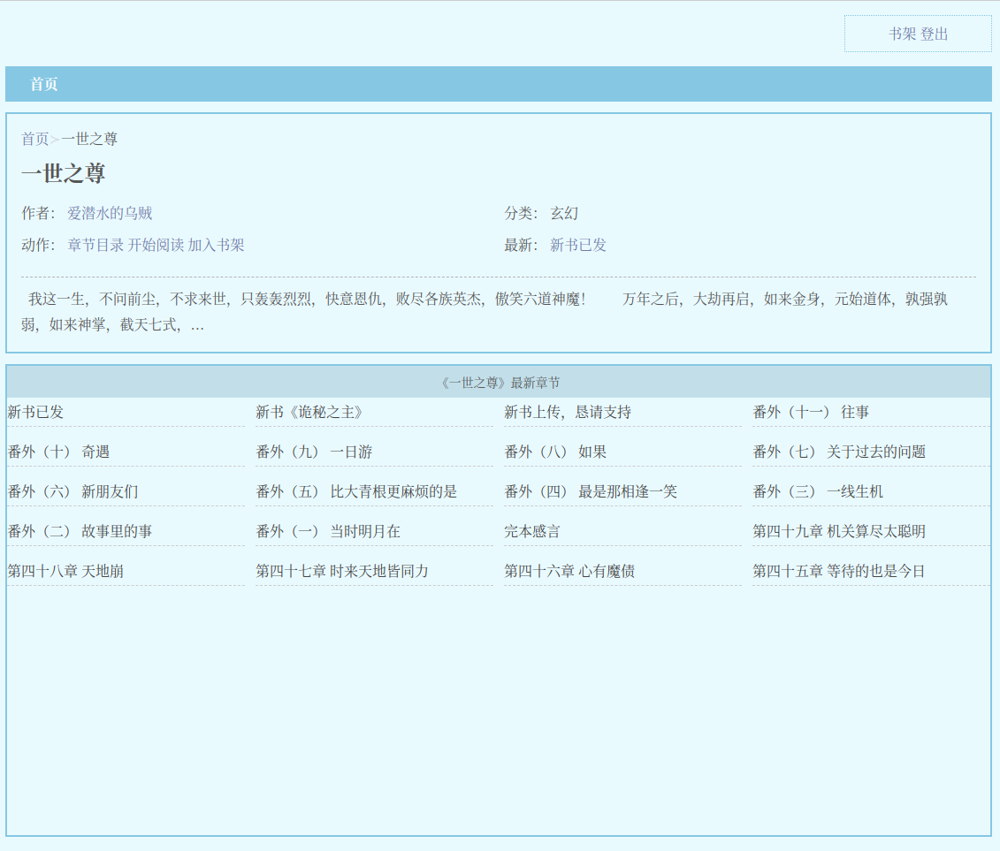

# 网络小说阅读网站

## 技术栈

- 后端：FastAPI + SQLAlchemy + Jinja2
- 前端：Bulma + 原生JS

## 安装

```bash
# 也可以用venv
conda create --name webnovel python=3.11
conda activate webnovel

git clone https://github.com/hesic73/webnovel
cd webnovel
pip install -r requirements.txt
```

### 运行

使用以下命令运行此应用：

```
fastapi dev app # 开发模式
fastapi run app # 生产模式
```

也可以使用[gunicorn](https://gunicorn.org/)作为生产服务器：


```bash
pip install gunicorn
gunicorn --bind 0000:8000 -w 4 -k uvicorn.workers.UvicornWorker app:app
```

## 第三方功能组件

- 管理面板使用[SQLAdmin](https://github.com/aminalaee/sqladmin)

- 验证使用[AuthX](https://github.com/yezz123/AuthX)

## 截图

- 主页


- 小说信息



- 目录


- 章节内容


## 其他

- 数据库使用SQLite。
- 用户注册默认为普通用户，管理员账户需要手动在数据库中修改。
- 小说数据从笔趣阁网站爬取。
